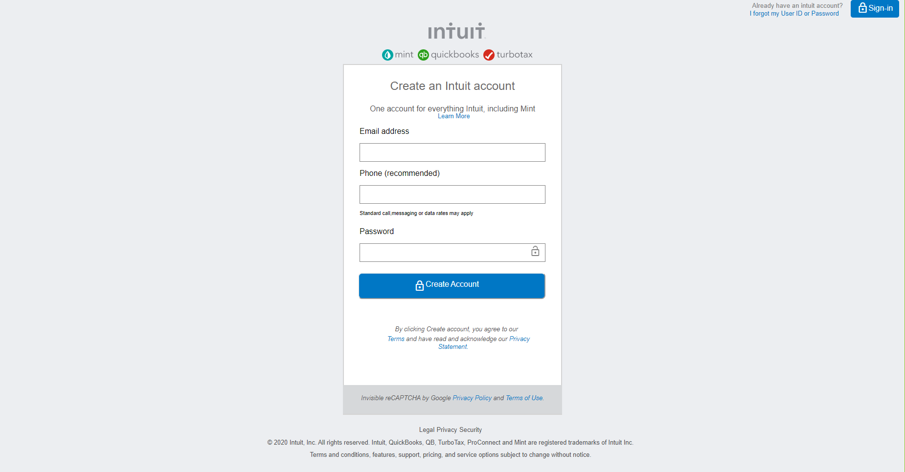

# Project 2 - HTML Forms
​
This is an assigned project where we were supposed to replicate/clone <a href="https://accounts.intuit.com/signup.html?offering_id=Intuit.ifs.mint&namespace_id=50000026&redirect_url=https%3A%2F%2Fmint.intuit.com%2Foverview.event%3Futm_medium%3Ddirect%26cta%3Dhero_sign_up_free_ProspectWeb%26ivid%3Dddfff704-1e22-4a27-ade6-46cb8dcfb7e3%26adobe_mc%3DMCMID%253D09763015799951790270192162432395205604%257CMCORGID%253D969430F0543F253D0A4C98C6%252540AdobeOrg%257CTS%253D1585819100%26ivid%3Dddfff704-1e22-4a27-ade6-46cb8dcfb7e3">Mint's sign up page</a> as seen in the link.​
​
## Preview of our webpage
​

​
## Built With
- HTML5
- CSS3
- Google icons (https://materializecss.com/icons.html)
​
## Live Demo of our project

https://jamestucker1988.github.io/form-project2-microverse-curriculum/
​
​
## Authors
​
👤 **Losalini Rokocakau**
​
- Github: [@chelmerrox](https://github.com/chelmerrox)
- Twitter: [@chelmerrox](https://twitter.com/chelmerrox)
- Linkedin: [Losalini Rokocakau](https://www.linkedin.com/in/losalini-rokocakau)

​
👤 **Anand Kumar**
​
- Github: [@jamestucker1988](https://github.com/jamestucker1988)
- Twitter: [anandku74070598](https://twitter.com/anandku74070598)
- Linkedin: [Anand Kumar](https://linkedin.com/in/anand-kumar-9128)
​
## �� Contributing
​
Contributions, issues and feature requests are welcome!
​
Feel free to check the [issues page](https://github.com/jamestucker1988/form-project2-microverse-curriculum/issues).
​
## Show your support
​
Give a ⭐️ if you like this project!
​
## Acknowledgments
- Our Stand-Up Teams
- Microverse TSE's
​
## �� License
​
This project is [MIT](LICENSE.txt) licensed.
